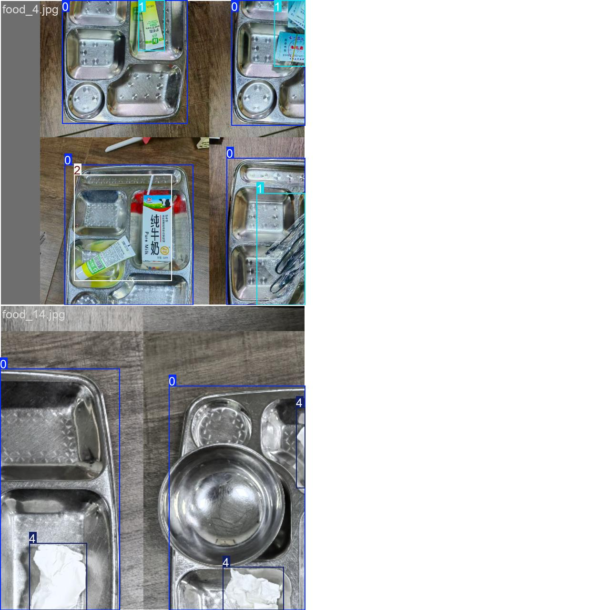

# 智眸云鉴 - AI 视觉驱动的食堂剩饭精准管理系统

## 项目简介

智眸云鉴是一个基于 AI 视觉技术的食堂剩饭精准管理系统。该系统通过智能化手段对剩饭行为进行精准监测和分析，旨在提升反食品浪费的精准性，强化监督与问责机制，推动节约意识的普及与深化，助力资源节约与可持续发展，提升公共机构治理效能。

### 当前食堂剩饭管理痛点

- **数据缺失**：传统人工统计方式效率低、误差大，难以及时获取剩饭量数据。
- **供需失衡**：备餐量与实际需求不匹配，易导致过量供应或短缺。
- **缺乏动态反馈**：无法根据剩饭情况实时调整菜单或供餐策略。
- **环保压力**：剩饭处理成本高，且易造成环境污染。

### 现有解决方案的局限性

- **依赖人工巡查和问卷调查**：时效性差。
- **简单计量工具（如称重）**：缺乏数据整合与分析能力。
- **缺乏对剩饭来源的深度分析**：无法分析菜品偏好、时段、人群等信息。

## 数据集准备与标注

本项目构建的专用数据集包含三千多张图像，覆盖36种菜品。通过多维度标注（包括边界框与类别标签）建立了餐饮场景的视觉语义映射关系，为多目标检测模型的鲁棒性训练与跨场景泛化能力评估提供了高价值数据支撑。

- **多模态特征融合**：结合图像纹理、颜色分布和容器形状进行综合判断。
- **动态数据增强**：通过模拟不同光照、遮挡场景生成训练数据，提升模型泛化能力。
- 

### 数据标注与模型泛化难题

- **半监督学习**：利用少量标注数据和大量无标签数据训练，降低标注依赖。
- **迁移学习框架**：预训练通用菜品识别模型，再针对特定场景微调。

### 原理结构图

- **物联网层**：部署摄像头，采集餐盘剩余量数据。
- **数据传输层**：通过 Wi-Fi/5G 将数据传输至云端平台。
- **数据分析层**：利用机器学习算法挖掘剩饭规律。
- **应用层**：可视化管理后台，提供备餐建议、浪费预警及环保报告。

## 模型训练

混淆矩阵

F1-score

## 测试示例

## 模型部署

支持IP摄像头实时检测和视频检测，moni_detected.mp4

## 版权信息

智眸云鉴系统版权所有，未经授权，禁止复制或使用。
